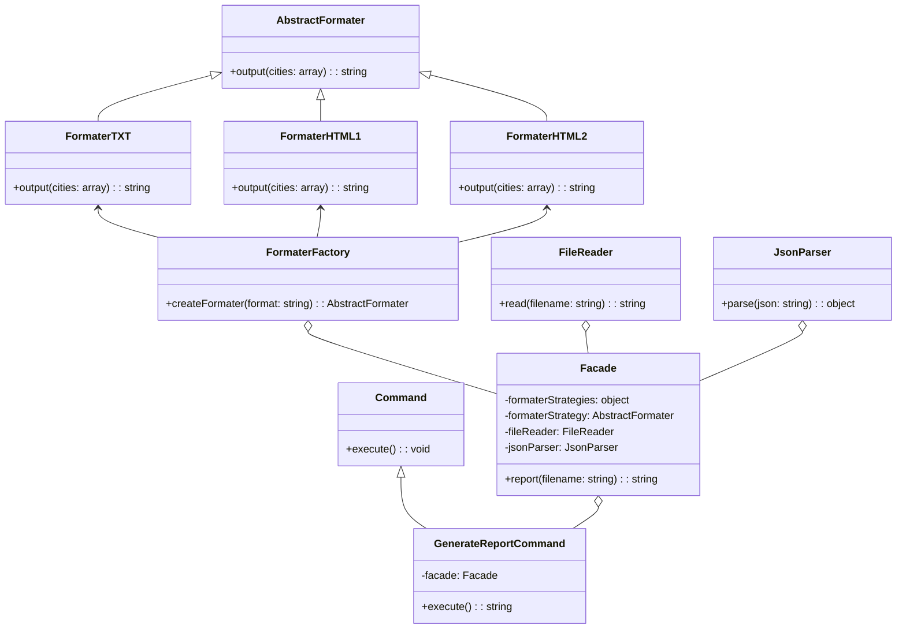

# Arquitetura de Software
critérios:

Com base [nesse sistema](https://github.com/watinha/es46a-2023-2/tree/strategy/01-design-patterns-template-strategy), Aplicar um padrão de projeto criacional, estrutural e um comportamental. Justifique o porque das escolhas em documentação que aponte, ainda, tres refatorações (use os princípios SOLID). Deve ser construido um script de teste, que garanta a consistencia das saídas esperadas após as alterações.

### Padrão Estrutural - Facade
aplicado para simplificar a interface do sistema. a classe  `index.js` estava diretamente acoplada às classes  `FormaterHTML` e `FormaterTXT`, e precisava criar uma instância da classe  `CitiesReporter` para gerar o relatório. Isso aumenta a complexidade do código. a classe  `Facade`, foi encapsulado toda a lógica de leitura, facuilitando o código com isso só é necessario criar uma instancia e chamar o método

### Padrão Comportamental - Command
Qualquer alteraçaõ no código original dependia de modificações no `index.js`. Com Command pattern o código se tornou mais flexível e dinâmico, simplifica a interação do usuário.


### Single-responsibility Principle
Foi dividido as responsabilidades em classes separadas. Para isso, foi criado a classe `FileReader` para lidar com a leitura do arquivo e uma classe `JsonParser` para lidar com a análise do JSON, dessa forma, deixando cada classe com uma única responsabilidade.
    
### Open-closed Principle
O código estava preparado para lidar apenas com dois formatos: ‘html’ e ‘txt’. Se fosse necessário adicionar um novo formato, teria que modificar o código existente. Para tornar o código mais aberto para extensão, mas fechado para modificação, a criação das estratégias de formatação foi movida para uma fábrica (`FormaterFactory`) que retorna a estratégia de formatação com base no argumento fornecido, tornando mais fácil adicionar novos formatos sem modificar o código existente.

### Dependency Inversion Principle
Qualquer mudança nas classes concretas poderia afetar a classe  `CitiesReporter`. Na refatoração, a classe  `Facade`  agora recebe suas dependências (`formaterStrategy`,  `fileReader` e `jsonParser`) como argumentos para o construtor. Com isso, `Facade` agora depende de abstrações, não de classes concretas, tornando o código mais flexível e fácil de modificar.


# Diagrama de Classe:




# Instruções de Uso

Este projeto requer o Node.js para ser executado localmente. Certifique-se de ter o Node.js instalado em sua máquina antes de prosseguir com as seguintes instruções.

### Instalação de Dependências
Abra o terminal e navegue até a pasta raiz do projeto e execute:

```
npm install
```
### Inicie o Servidor
Após a conclusão da instalação das dependências, você pode iniciar o servidor executando o seguinte comando:

```
npm -s start
```
